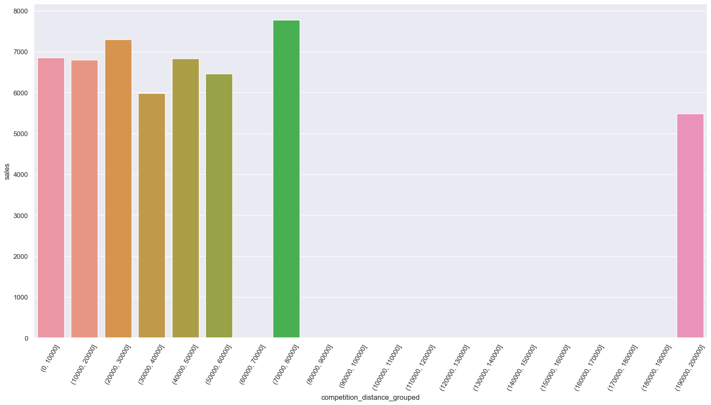
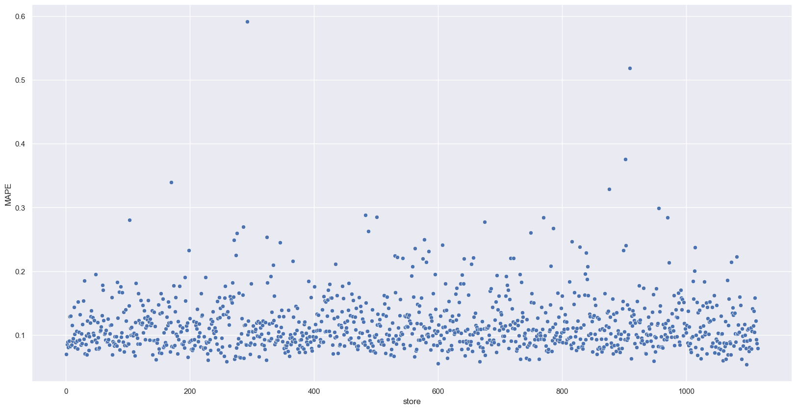
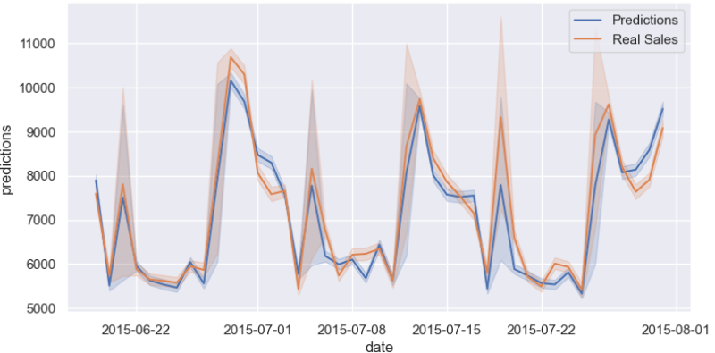

<h1 align="center">
  Previsão de Vendas das Lojas Rossmann - Projeto de Regressão
</h1>

<h1 align="center">
  
</h1>

## 1. Problema de Negócio
    
### 1.1 Negócio

A Rossmann existe desde 1972 e está representada por mais de 2150 filiais em toda a Alemanha (clique aqui para saber endereços em Berlim), segundo dados de 2019. Das drogarias na Alemanha, é a campeã de vendas. Dentre tantas marcas conhecidas, como Nivea, L’Oreal ou Schwarzkopf, vale a pena ainda destacar suas próprias marcas: Isana, Alterra, enerBio ou Babydream.

**Fonte:** [https://www.pelaalemanha.com.br/2020/12/09/drogarias-na-alemanha/](https://www.pelaalemanha.com.br/2020/12/09/drogarias-na-alemanha/)

### 1.2 Contexto/Motivação da Problemática

CFO da empresa fez uma reunião de resultados mensais com todos os gerentes de loja e requisitou que cada um deles trouxessem uma previsão diária das próximas 6 semanas de vendas. Depois dessa reunião, vários gerentes entraram em contato, solicitando uma previsão de vendas das lojas as quais gerenciam.

### 1.3 Entendimento do Problema de Negócio

- **Problema/Questão de Negócio:**  *O que?* 

Problema de Previsão diária das próximas 6 semanas de vendas.

- **Causa Raiz do Problema:**  *Porque realizar esse projeto?* 

CFO quer fazer investimento em reforma das lojas e precisa saber com precisão o valor que poderá investir nelas e o quanto a loja terá de retorno (vendas) para pagar esse investimento.

- **Dono do Problema:** *Principal parte interessada?*

CFO ou alguém muito próximo a ele.

## 2. Planejamento da Solução
### 2.1 Produto Final
Treinar um algoritmo de regressão que realizará a predição de vendas diárias de cada loja nas próximas 6 semanas. As predições serão acessadas via celular via aplicativo Telegram. E o retorno da predição será a soma da previsão de vendas diárias ao longo de 6 semanas (42 dias), na qual o usuário irá indicar a loja a qual deseja saber a previsão de vendas e receberá a resposta.

**Arquitetura do Produto de Dados:**

<h1 align="center">
  
</h1>

### 2.2 Processo
O projeto foi realizado utilizando a metodologia cíclica CRISP-DS, utilizada na indústria para controlar processos, adaptado para Data Science. O objetivo é a melhoria contínua aliada a entrega rápida de valor em soluções end-to-end.   

<h1 align="center">
  
</h1>

1. **Questão de Negócio:** problema de negócio a ser resolvido;
2. **Entendimento do Negócio:** definição das condições do problema. (Motivação, Causa Raiz, Parte Interessada, Formato da Solução);
3. **Coleta de Dados:** Através do *download* do conjunto de dados que está disponibilizado na plataforma Kaggle.
4. **Limpeza dos Dados:** consiste em renomear colunas, garantir tipos de dados corretos, verificar NA´s e substituir baseado em critérios, resumo dos dados (estatística descritiva). Pode ser denominada como etapa de ***Descrição dos Dados***.

5. **Exploração dos Dados:** consiste em compreender as variáveis/atributos que impactam o fenômeno (target) de análise. Geração de insights de negócio. Engloba as etapas de Feature Engineering, Filtragem de Variáveis e EDA de um projeto de Ciência de Dados.         

    5.1. *Feature Engineering:* nessa etapa realiza-se o mapa mental de hipóteses, criação e/ou ajuste de features que serão necessárias para validar as hipóteses de negócio levantadas.
  
    5.2. *Filtragem de Variáveis:* consiste na restrição de atributos/features/variáveis de acordo com o negócio.
  
    5.3. *Análise Exploratória de Dados (EDA):* consiste em medir o impacto das features/atributos na variável resposta (fenômeno que se está avaliando) por meio de análise univariada, bivariada e multivariada. 

6. **Modelagem dos Dados:** preparar os dados para ensinar os algoritmos de *machine learning* os padrões. Compreende as etapas de Preparação dos Dados e Seleção de Features de um projeto de Ciência de Dados..

    6.1. *Preparação dos Dados:* nessa etapa realizam-se as transformações, normalizações para que o aprendizado dos algoritmos de ML sejam facilitados.

    6.2. *Seleção de Features:* consiste em selecionar features mais relevantes para o modelo, por meio do método de seleção por Subset (*Wrapper Methods*) utilizando o algoritmo Boruta.

7. **Algoritmos de Machine Learning:** dados modelados de treino são colocados para os algoritmos de *machine learning* aprenderem padrões sobre o fenômeno. Além disso, aplica-se método de validação cruzada para séries temporais (Time Series Cross Validation) visando extrair a performance real dos modelos de *Machine Learning*. Por fim, para o algoritmo com melhor desempenho aplica-se o *Hyperparameter Fine Tuning* com a estratégia de busca aleatória (Random Search) com o objetivo de encontrar os parâmetros que maximiza a performance do modelo.
8. **Avaliação do Algoritmo**: entender a performance do algoritmo sob os dados e traduzir em impacto nas métricas de negócio.
9. **Modelo em Produção:** publicação (*Deploy*) em servidor na nuvem da capacidade de previsão do modelo para que seja acessível para qualquer consumidor via aplicativo Telegram.

### 2.3 Ferramentas
  - Python 3.8.15
  - Pandas, Seaborn, Matplotlib e Sklearn
  - Flask e Python API's
  - Git e GitHub
  - Jupyter Notebook
  - Atom 
  - Algoritmos de Regressão (Regressão Linear/Lasso, Random Forest Regressor, XGBoost Regressor)
  - Telegram Bot API
  - Render Cloud 

## 3. Dados
A base de dados de treino utilizada contém 1.017.209 registros de vendas das lojas ao longo do tempo, referente ao período 01/01/2013 à 31/07/2015 para 1.115 lojas.
A base de dados de teste utilizada contém 41.088 registros de vendas das lojas ao longo do tempo, referente ao período 01/08/2015 à 17/09/2015 para 856 lojas.

Os dados para esse projeto foram coletados na plataforma do Kaggle: https://www.kaggle.com/competitions/rossmann-store-sales/data

### 3.1 Resumo dos Atributos/Variáveis 

|    Atributos    |                         Definição                            |
| :-------------: | :----------------------------------------------------------: |
|          Store         |                          Identificação única para cada loja                     |
|     DayOfWeek    |                            Dia da semana. (1 a 7)                           |
|      Date     |                    Data observada para análise de vendas da loja                      |
|    Sales   |       Volume de vendas para qualquer dia (isto é o que deve-se prever)           |
|    Customers   |                   Número de clientes num determinado dia                       |
|   Open   |       Indicador para saber se a loja estava aberta. (0 = fechado, 1 = aberto)        |
|    Promo   |  Indica se uma loja está com promoção nesse dia. (0= sem promo , 1 = promo)   |
|       StateHoliday      |   Indica feriado ( a = feriado estadual, b = feriado da Páscoa, c = Natal, 0 = nenhum)    |
|    SchoolHoliday   |    Indica se a (Loja, Data) foi impactada pelo dia não-letivo de escolas públicas     |
|           StoreType         |       Diferencia entre 4 modelos de loja diferentes. (a, b, c, d)        |
|    Assortment    |   Nível de sortimento dos produtos existentes. (a = básico, b = extra, c = estendido)  |
|      CompetitionDistance    |     Distância em metros até à loja concorrente mais próxima     |
|    CompetitionOpenSinceMonth   |  Mês aproximado da abertura do concorrente mais próximo  |
|    CompetitionOpenSinceYear   | Ano aproximado da abertura do concorrente mais próximo |
|    Promo2    |    É uma promoção ampliada e consecutiva para algumas lojas. (0 = a loja não participa, 1 = a loja participa)    |
|   Promo2SinceWeek   |        Semana em que a loja começou a participar da Promo2        |
|    Promo2SinceYear    |            Ano em que a loja começou a participar da Promo2             |
|    PromoInterval    |    Descreve os intervalos consecutivos em meses em que a Promo2 é iniciada    |

### 3.2 Detalhamento atributos 

A interpretação de alguns atributos mais subjetivos está colocada no [arquivo python notebook]( https://github.com/alancechin/prediction_sales/blob/main/predict_sale_m10_finish.ipynb) na seção 1.0. - Descrição dos Dados, logo no início.

## 4. Premissas 

Dados Faltantes: 

- Foram detectados dados faltantes em 6 atributos/features, esses foram tratados utilizando-se da estratégia de compreensão da lógica de negócio existente e assumindo premissas. Cada coluna com dados faltantes e a explicação sobre a resolução baseada em considerações de negócio estão relatadas na etapa 1.0. Descrição dos Dados > 1.5 *Fillout* NA no [arquivo de desenvolvimento notebook em python]( https://github.com/alancechin/prediction_sales/blob/main/predict_sale_m10_finish.ipynb).

Restrições de Negócio: 

- Excluiu-se da base de dados de treino a coluna *customers*, que refere-se a quantidade de clientes em um determinado dia na loja, pois não pode-se contar com ela no momento da previsão devido a não saber com antecedência, ou seja, para as próximas seis semanas, a quantidade de clientes que entrarão na loja. Sendo assim, o modelo não pode ser treinado com ela.

- Considerou-se para treinamento apenas registros de dados de venda de lojas abertas, com a coluna *open*, diferente de zero, pois o objetivo é fazer a previsão de vendas das lojas em condições onde possui uma variação nas vendas, e isso ocorre, quando ela está aberta. 

- Por fim, excluiu-se da base de dados alguns poucos registros de dias em lojas com vendas igual a zero, isso pois, não temos interesse de analisar o fenômeno quando as vendas são zero, pois a intenção é analisar as características dos registros quando houve vendas significativas. 

*OBS:* Não foram detectados registros duplicados na base de dados e nem valores outliers nos atributos.

## 5. Principais Insights 

**H1:** Lojas com competidores mais próximos deveriam vender menos, em média.

❌ **Falsa:** 
      
- Lojas com competidores mais próximos não vendem menos, em média, mas também não vendem mais.
      
- O atributo distância do competidor não tem correlação alta com as vendas.

<h1 align="center">
  
</h1>
      

**H2:** Lojas deveriam vender mais, em média, depois do dia 10 de cada mês.

 ❌ **Falsa:** 
 
 - Média de vendas diminui à medida que o dia do mês aumenta.

<h1 align="center">
  
</h1>

**H3:** Lojas deveriam vender menos, em média, aos finais de semana.

✅ **Verdadeira:** 

- Devido a baixa média de vendas do sábado, o fim de semana acaba ficando com uma média de vendas menor que ao longo da semana. No entanto, o domingo possui a melhor média de vendas junto com a segunda-feira.

<h1 align="center">
  
</h1>

**OBS:** Mais hipóteses de negócio foram também validadas e estão presentes na seção 4.0. Análise Exploratória dos Dados no [arquivo python notebook]( https://github.com/alancechin/prediction_sales/blob/main/predict_sale_m10_finish.ipynb).

## 6. Modelos de *Machine Learning*

Foram avaliados 5 modelos os quais receberam dados de treino para aprenderem aspectos sob o fenômeno de previsão das vendas:

- Média (utilizado como Baseline)
- Regressão Linear
- Regressão Linear Regularizada (Lasso)
- Random Forest Regressor
- XGBoost Regressor

Com o objetivo de extrair a performance real dos modelos de *Machine Learning* dividiu-se o conjunto de dados de treino em diversas partes para medir a performance em cada uma delas (1ª parte de validação e o restante de treinamento), e assim, obter um resultado final de performance do modelo mais coerente para distintas distribuições dos dados. Para isso, foi implementado o método de validação cruzada para séries temporais (*Time Series Cross Validation*).

Objetivando mensurar o quão longe a predição do seu modelo está do valor real utilizou-se as seguintes métricas de desempenho: 
- MAE (*Mean Absolute Error*): Erro Absoluto Médio. Diferença absoluta entre o valor real e o valor predito, em média.
- MAPE (*Mean Absolute Percentage Error*): Erro Absoluto Percentual Médio. Diferença absoluta entre o valor real e o valor predito, dividido pelo valor real, em média.
- RMSE (*Root Mean Squared Error*): Raiz Quadrada do Erro Quadrático Médio. Diferença entre o valor real e o valor predito elevado ao quadrado, em média, e extrai a raiz quadrada.

As performances de cada modelo em ordem crescente são:

| Modelo | MAE | MAPE | RMSE |
|--------|-----|------|------|
| Random Forest Regressor| 865,05 +/- 254,9| 0,12 +/- 0,03| 1305,06 +/-392,86|
|XGBoost Regressor| 1075,13 +/- 161,16|0,15 +/- 0,02|1550,83 +/- 227,38|
| Média (Baseline) |1354,80| 0,21| 1835,14|
|Linear Regression| 2077,3 +/- 296,01|0,3 +/- 0,02| 2944,9 +/- 468,99|
|Linear Regression - Lasso |2117,39 +/- 342,62| 0,29 +/- 0,01| 3057,28 +/- 505,55|

Os modelos de Regressão Linear e Regressão Regularizada Lasso apresentaram performances inferiores ao modelo simples de Média, o que mostra que o comportamento dos dados não é linear, e conduz as análises para modelos mais complexos.

Mesmo o modelo de Random Forest Regressor apresentando a melhor performance na etapa de validação, o modelo escolhido para prosseguimento e otimização dos hiperparâmetros (*Hyperparameter Fine Tuning*) foi XGBoost Regressor. A escolha ocorreu devido ao menor tempo de processamento para treinamento do algoritmo, e pela diferença em termos de performance nas métricas de resultado não ser tão elevada.

**Performance Final de Aprendizado de Máquina:**

Após a otimização dos hiperparâmetros (*Hyperparameter Fine Tuning*) do modelo utilizando a estratégia de Random Search, sua performance nos dados de validação foram:

|Modelo| MAE | MAPE | RMSE |
|------|-----|------|------|
| XGBoost Regressor | 767,25 | 0,12 | 1098,15 |

*Gráfico de dispersão para analisar lojas mais difíceis de realizar predição*

<h1 align="center">
  
</h1>

*Análises*

- Maioria das lojas possui erro médio abaixo de 20% de erro do modelo sob a média de vendas real diária ao longo de 6 semanas.

- Existem de 40 a 50 lojas com erro médio abaixo de 40% e acima de 20% de erro do modelo sob a média de vendas real diária ao longo de 6 semanas.

- Existem 2 lojas com erro médio acima de 50% de erro do modelo sob a média de vendas real diária ao longo de 6 semanas.

Valor real de vendas em comparação com o valor predito para as próximas seis semanas, no período do dia 19/06/2015 à 31/07/2015, data que compreende os dados de validação. 
 <h1 align="center">
  
</h1>

## 7. Tradução/Interpretação para Resultados Financeiros   

O pior e melhor cenário para o somatório de vendas nas próximas seis semanas das lojas pode ser calculado. As 3 lojas com maior percentual de erro de predição do modelo ficariam com os seguintes cenários de vendas.

|Loja| Predição | Pior cenário | Melhor cenário | MAE | MAPE |
|----|----------|---------|---------------------|-----|------|
| 292 | 107.134,09 | 103.762,76 | 110.505,43 | 3371,33| 0,59|
|909|220.876,03|212.959,34|228.792,72|7916,69|0,52|
|902|203.681,45|202.174,06|205.188,84|1507,39|0,38|

Somatório predições de vendas, melhor cenário e pior cenário para todas as lojas nas próximas seis semanas:

| Cenário | Valores |
|---------|---------|
|Predição| US$ 287.317.504,00|
|Pior cenário|US$ 286.458.540,85|
|Melhor cenário|US$ 288.176.494,26|

   
## 8. Modelo em Produção (*Deploy*) 

Para consultar os resultados da predição de vendas do modelo para as lojas de uma forma mais interativa e remota, desenvolveu-se um BOT no Telegram. Acessível para qualquer consumidor com o app do Telegram baixado em dispositivo conectado na internet para fazer requisição na API, onde a aplicação do projeto de dados com o modelo treinado está hospedada no serviço em nuvem Render.

Ao acessar o BOT no Telegram, denominado como [RossmannBot]( https://t.me/ross_predict_sale_bot), é necessário enviar uma mensagem no formato  "/store_number" (ex: /50). O Bot responderá com o valor de vendas previsto para as próximas seis semanas, caso o número da loja não esteja disponível nos dados de teste usados para a aplicação, apresentará a mensagem "ID Loja não disponível, digite outro ID de loja".

 Em caso de digitar algo diferente de um número de loja entre os números 1 à 1115, apresentará a mensagem " ID Loja está errado! - confirme que você está digitando corretamento o número da loja". A imagem abaixo mostra um exemplo do funcionamento.

           

## 9. Conclusão

Com o resultado alcançado, o objetivo foi atingido e o CFO da empresa pode junto ao time de operações e negócio planejar a reforma que será feita nas lojas, e assim, ter uma boa noção do orçamento (*budget*) que poderá alocar esforços para aplicar na reforma. 

Além disso, ter uma previsão de vendas na operação de qualquer empresa possui diversos benefícios como melhor gestão de estoques, contratação otimizada de funcionários, melhor margem para negociar com fornecedores. Cada um destes benefícios possui retornos financeiros que podem ser extremamente significativos e podem ser estimados dado a realidade de cada empresa. 

## 10. Próximos Passos

- Gerar novas hipóteses para buscar novos insights para o negócio;

- Aplicar modelo de previsão em paralelo para predizer o número de clientes que entrará nas lojas nas próximas semanas, as quais podem ser relevantes para o modelo de previsão de vendas;

- Testar outros modelos de regressão para análise de performance;

- Utilizar outros métodos de otimização de hiperparâmetros como: Bayesiana, GridSearch;

- Testar outros tipos de transformações de variáveis na preparação dos dados, e avaliar o impacto no desempenho dos modelos;

- Derivar outras features que podem ser relevantes para o aprendizado do modelo;

- Melhorar a experiência do usuário na interação com o Bot.

 
